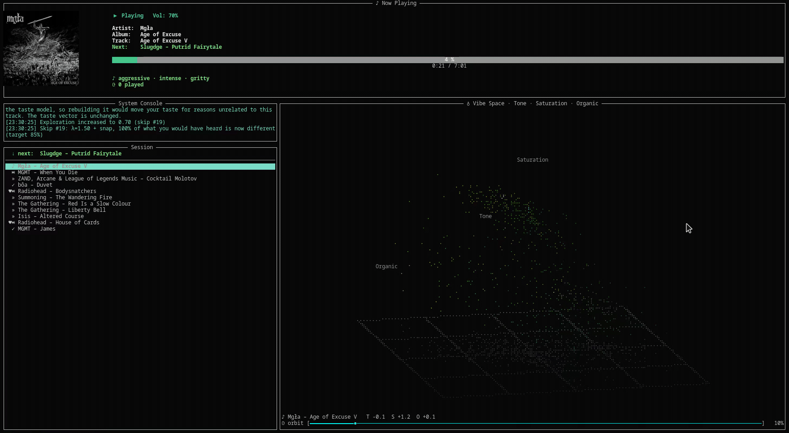
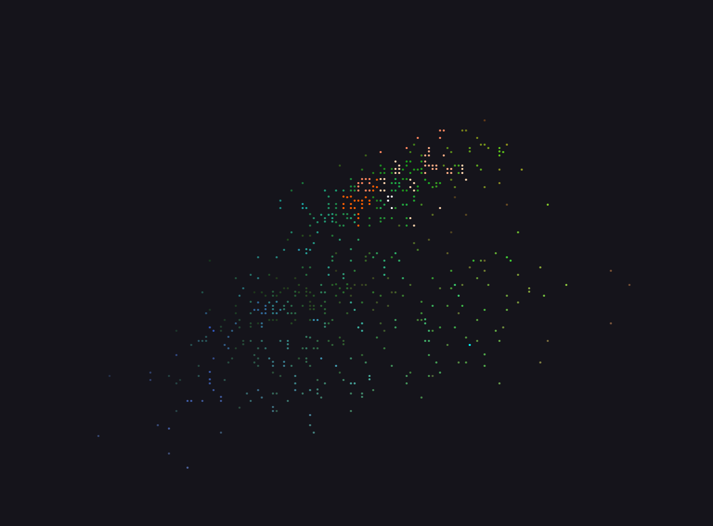
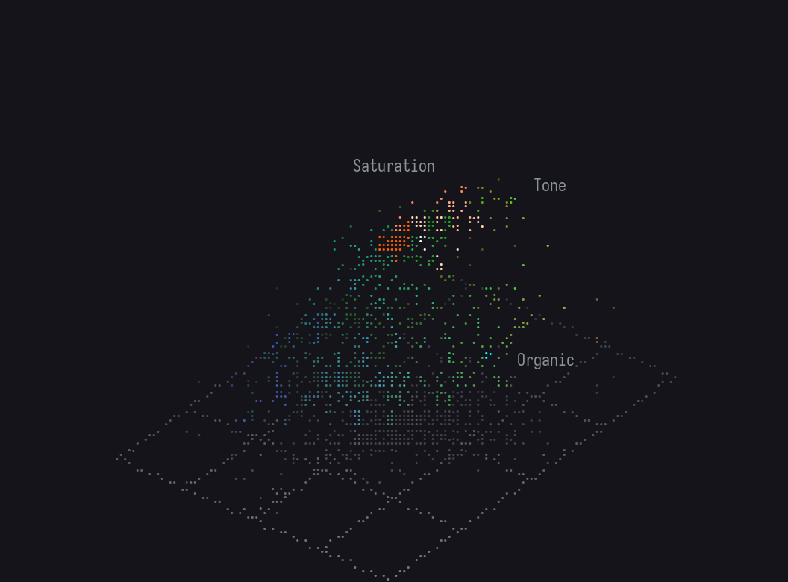
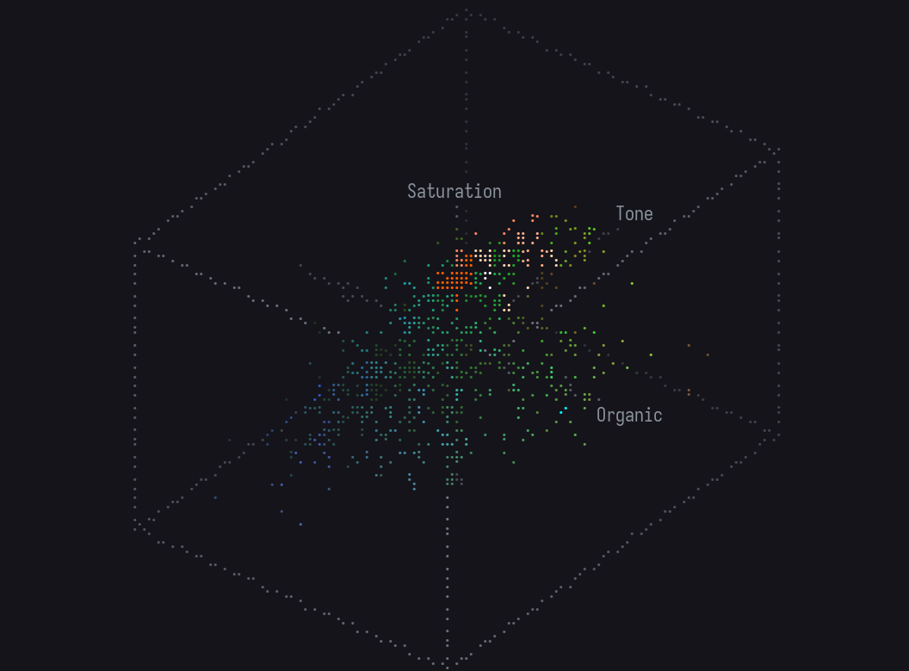
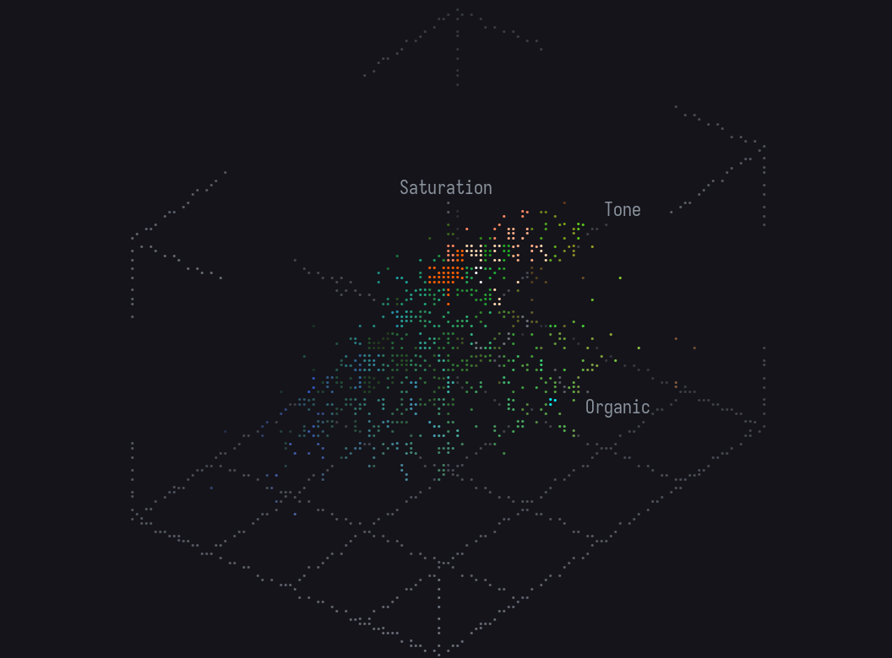

# Adaptive Session AI DJ

A terminal-based DJ that learns your taste in real time and curates a continuously evolving queue from your own music library — no streaming service, no account, no ads. Just MPD and your files.



`[B]` cycles the frame drawn behind the cloud, from a bare cloud to a ruled floor,
a labelled wireframe box, and crop-marks:

<table>
  <tr>
    <td align="center" width="50%"><br><code>off</code> — bare cloud</td>
    <td align="center" width="50%"><br><code>ground</code> — floor + shadow <em>(default)</em></td>
  </tr>
  <tr>
    <td align="center" width="50%"><br><code>box + axes</code> — wireframe + labelled axes</td>
    <td align="center" width="50%"><br><code>marks + ground + axes</code></td>
  </tr>
</table>

<sub>Design-time browser preview; the gif above is the live terminal render (Braille). A selected point reads out as <code>♫ artist – title</code>, the playing track as <code>♪</code>.</sub>

The body below Now Playing opens on a **split** view — the console over the
session history in a narrow left column, and a live **vibe cloud** in the wide
right one. The cloud is an auto-rotating 3-D point cloud of your whole library in
mood space, with a comet tracing your session's trajectory. `[T]` cycles the body
from the split to the full-screen cloud, history, and console in turn (or
`F1`/`F2`/`F3` jump straight to one), so each gets the whole panel when you want
it. The next track shows on the `Next:` line in Now Playing, so you never have to
leave the cloud to see what's coming. **Right-drag** to orbit, **scroll** to zoom,
**click** a point to see which track it is (and press **`[P]`** to play it), and
drag the **orbit slider** to set the spin speed (it starts slow).

There is no title bar and no keybinds footer — press **`[K]`** for the full list
of keys, over whatever pane you are on.

---

## Requirements

- **Python 3.9+**
- **MPD** (Music Player Daemon) + **MPC** — must be running with your music library indexed
- **Linux** with X11 or Wayland — album art is drawn by `ueberzug` / `ueberzugpp`, which need a graphical surface. Developed on Fedora with Python 3.14.
- **Album art needs a single attached client** (tmux or not). ueberzug/ueberzugpp draw the cover in
  absolute coordinates against one output surface, so tmux with multiple attached clients of differing
  geometry can knock the cover out until a resize — a limitation of overlay image protocols, not the app.
- **About 1.3 GB of free disk** for the first run — 1.15 GB of model cache and a 46 MB embedding file.
  See "First run" below for where that goes.
- A GPU is optional. See the table below for what it costs without one.

---

## Setup

Everything is handled by a single script:

```bash
git clone https://github.com/imaalej/mpd_tui_ai_dj
cd mpd_tui_ai_dj
bash start.sh
```

`start.sh` will check your Python version, install pip dependencies, verify MPD is reachable, locate MPD's music directory, and walk you through generating embeddings if this is your first run. After that it launches the TUI automatically.

The music directory is read from MPD's own config (`~/.config/mpd/mpd.conf`, `/etc/mpd.conf`, …). If that cannot be found you will be asked for it; set `MPD_MUSIC_DIR` to skip the question permanently.

**First run only — embeddings:** The DJ needs audio fingerprints of your library to find musically similar tracks. These come from [CLAP](https://github.com/LAION-AI/CLAP), and generating them is the one slow step: a model download, then a decode-and-encode pass over every track.

Every number here is measured on this machine against a 674-track library, not estimated:

| | Measured |
| --- | --- |
| Model cache after the first run | **1.15 GB** (1,232,327,859 bytes) |
| Why it is twice the model's size | The repo's `main` carries only `pytorch_model.bin` (614.5 MB); transformers ≥ 5 also fetches the safetensors conversion from `refs/pr/3` (614.4 MB), and both stay cached |
| Embedding pass, RTX 3070 | **5 min 23 s** — 674 tracks, 24,494 windows, 75.8 windows/s |
| Embedding pass, CPU only (12 threads) | **≈ 25–35 min** — the audio encoder runs at 17.0 windows/s against the GPU's 333 |
| Output | `track_embeddings.npz` **45.5 MB** + `descriptors.npz` 93 KB |

`start.sh` refuses to begin a run that cannot finish, checking free space against the same figures.

Tracks are enumerated from `mpc listall`, so the embedding keys are exactly the paths MPD will be asked to play. Files MPD cannot decode are skipped and listed in `data/embeddings/failed.txt` with the reason, rather than disappearing silently.

There is no "demo mode" with random vectors. Random embeddings make every similarity, every novelty score and every learned preference meaningless while the interface keeps presenting them as insight — it looks like it works, and none of it does.

You only ever run this once. The result is saved to `data/embeddings/`.

### Manual MPD setup (if needed)

```bash
# Ubuntu/Debian
sudo apt install mpd mpc

# Point MPD at your music and build the database
mpc update
mpc status   # should show your track count
```

---

## Controls

| Key | Action |
| ----- | -------- |
| `Space` | Play / Pause |
| `N` | Skip track — a rejection; escalates if you keep pressing it (see below) |
| `V` | Pass — move on to the queued track without changing the vibe |
| `L` | Like current track — press again on a liked track to un-like it |
| `↑` / `↓` | Move the cursor through the session history |
| `+` / `−` | Zoom the cloud in / out |
| `Enter` | **Over the full cloud:** reset the view. **Otherwise (history or split):** replay the track under the cursor — it becomes `↓ next:` |
| `P` | Play the point selected in the cloud **now** — asks to confirm first; the current track is passed over with no penalty |
| `B` | Cycle the frame drawn behind the cloud: none → ground → box + axes → marks + ground + axes |
| `T` | Cycle the body pane: split → cloud → history → console → split |
| `F1` / `F2` / `F3` | Jump straight to the cloud / history / console pane |
| `,` / `.` | Volume down / up |
| `←` / `→` | Seek backward / forward 10s |
| `I` | Show model state (descriptors, sampling, taste, exploration, weights) — `↑↓` scrolls it |
| `K` | Show this keybinding list — `↑↓` scrolls it, any other key closes |
| `Q` | Quit |
| mouse | Over the cloud: **right-drag** to orbit, **scroll** to zoom, **left-click** a point to inspect its track, and drag the **orbit-speed slider** at the bottom |

The camera is a mouse instrument — right-drag to orbit, scroll to zoom — so the
arrows are free to always mean "move the history cursor". `Enter` is the one key
that does two things: it recentres the cloud when the cloud is the whole body, and
otherwise replays the focused history track — so in the split, where the history
is on screen and keyboard-driven, `Enter` replays and the mouse recentres. That is
a focus mode, not a second binding table — the key reaches one dispatch method,
which acts on whichever view is showing. Everything else means the same thing
everywhere. `B`, `+`/`−` and the mouse act on the cloud wherever it is drawn, the
full pane or the split's right column.

The bindings are identical in the urwid interface and the plain-text fallback (both
dispatch through one handler, so a key cannot exist in one and not the other), and
the `[K]` popup is generated from that one list.

**What un-liking does to the model.** Retracting a like is not a negative update — a
normalised moving average can't be un-added (subtract your only like and the taste
vector still points exactly at the track you just rejected). So `L` removes the like
from your feedback history and *recomputes* taste from what's left: the model you'd
have had if you'd never pressed the key. The one exception is a history capped at
1000 events, where a recompute from a partial history would move the vector for
unrelated reasons — there the retraction is display-only (the heart goes, the model
stays), and the console says so.

---

## How It Works

### Audio Fingerprints

Every track in your library is encoded into a 512-dimensional embedding vector that represents its sonic character — timbre, texture, energy, harmonic content. These come from [CLAP](https://github.com/LAION-AI/CLAP), a model trained to understand audio similarity. Two songs that *feel* similar will have embeddings that point in roughly the same direction in that space. All selection logic operates on these vectors; no genre tags or metadata are used.

CLAP's audio encoder takes exactly ten seconds of audio, so a track is covered by consecutive ten-second windows — the last one aligned to the end so nothing is dropped or padded with silence — and the window vectors are averaged into one. The whole track is represented, not a sample of it, and embedding the same file twice gives the identical vector. Near-silent windows are dropped; the per-window vectors are kept in the file so the pooling decision can be revisited without regenerating.

One more step matters more than it looks. CLAP's vectors occupy a narrow cone rather than the whole space: on this library, two *completely unrelated* tracks sat at a cosine similarity of 0.67. "Similar" and "unrelated" were nearly the same number, which is why the scoring weights never seemed to do much. Subtracting the library's own centroid at load time moves unrelated pairs to ≈ 0 and gives the rest of the system the range it always assumed it had.

### Two Layers of Preference

The system keeps two separate models of what you like, operating on different timescales:

**Session state** is short-term and lives only for the current listening session. It's a single vector that shifts with every track you hear — pulled toward songs you listen through and nudged away from songs you skip. It represents the *vibe right now*: where the session has been and the direction it's heading. It starts empty — before anything has played there is nothing to know, so the first track is drawn at random rather than from a direction the system invented.

**User taste** is long-term and persists between sessions. It accumulates slowly from everything you've heard across all sessions — strong pull toward explicit likes (`L`), weaker pull from full listens, and gentle pushback from skips. It doesn't reflect what you want *today*, it reflects what you've consistently come back to *across time*. New sessions start from a fresh vibe but are still anchored to your taste history.

### Track Selection

To choose the next track, the system scores a pool of candidates across four factors:

```
score = α · session_similarity
      + β · taste_similarity
      + γ · novelty
      + δ · anti_repetition_penalty
```

The weights (α, β, γ, δ) shift dynamically based on your behavior. Skip a few songs and the system increases `γ` (novelty) to try something different. Listen through several tracks and it lowers `γ`, leaning harder on what it already knows you like.

`β` is also *earned*. A new listener has no taste history, so the taste term starts at zero weight and ramps up over the first 20 updates, with the unearned weight going to the session term. Until then you are driven purely by what you are playing right now, which is the only thing known about you.

### Skipping, and what it means

`N` is the steering key. A single press says "not this song" — the session vector is nudged away from it and the queued track behind it is dropped and re-picked immediately.

`V` is its neutral counterpart: **Pass** means "not this song, but keep the vibe." It advances to the track already queued behind the current one and touches *none* of the model — no nudge to the session vector, no taste penalty, no exploration change, no escalation. Use `N` when the direction is wrong and `V` when the direction is fine but this particular track isn't. A passed track is marked `»` in the history.

Keep pressing and it escalates, because *n* consecutive rejections is the system observing that the neighbourhood is wrong — better evidence than a separate key you would have to reach for after diagnosing your own dissatisfaction. Each press targets a fraction of the candidate pool that must come out different:

| consecutive skips | turns over | reads as |
| --- | --- | --- |
| 1 | 5% | "not this song" |
| 2 | 20% | "not this corner either" |
| 3 | 50% | "this is the wrong direction" |
| 4+ | 85% | full reset |

The important part is that those are *targets*, and the magnitude of the move is solved for them at each press rather than being a constant someone picked. "85% of what I would have heard is now different" is something you can check; a rotation of 0.15 radians is not. The console reports what each press actually achieved.

From the second press onward the session vector is projected back onto your library — replaced with the centre of its 25 nearest real tracks — so however hard you push, it cannot drift into a region no music occupies. A full listen ends the run and the escalation resets.

### Exploration vs Exploitation

A single **exploration value** (0.1–0.7) controls how adventurous the DJ is. It increases with every skip and decreases with every full listen, meaning it self-calibrates to your engagement. If you're in a zone and letting tracks run, it narrows in. If you're skipping around, it opens up and reaches further from your established taste.

### Describing the session

The session line names what is playing, in words measured against your own library:

```
♪ hypnotic · nocturnal · sparse
⟳ 2 of 3 held over 5 tracks · 14 played
```

Those come from 49 descriptor prompts — energy, affect, texture, rhythm, setting, instrumentation — embedded with CLAP's *text* encoder and stored with each word's mean and standard deviation over your collection. A score is therefore a **z-score against your own music**, so *"hypnotic"* means "unusually hypnotic **for this library**" rather than "hypnotic in the abstract". That matters more than it sounds: CLAP's audio and text encoders are aligned but do not share a cone, so raw similarities are not comparable between words, and a naive top-3 would return the same three words forever.

The second line says how many of those three words were also on screen a few tracks ago. It is a count rather than a similarity score on purpose — measured over 40 real sessions, the underlying cosine sits above 0.95 nine times out of ten, so it reads as "0.99" almost always, while the word count spans its whole range (median 2 of 3, and 0 or 1 after a run of skips). `[I]` shows both, with the cosine labelled.

Nothing is shown before a track has played. The session vector starts at zero, and scoring a zero vector against the bank does not fail — it returns a confident-looking ranking of the bank's own baselines, which would be a description of nothing at all.

You can also ask for any track's descriptors from the command line:

```bash
python3 src/generate_embeddings.py --describe "Arctic Monkeys"
```

### The Session panel

Below the console, the **Session** panel shows the one track queued ahead, then what has actually played, newest first:

```
  ↓ next:  Pharoah Sanders – The Creator Has a Master Plan
 ──────────────────────────────────────────────────────────
 ♥♪ Floating Points – LesAlpx
  ✓ Alice Coltrane – Journey in Satchidananda
  ⏭ Kamasi Washington – Change of the Guard
```

`♥` is a track you have liked, at any point, across sessions. `✓` is a full listen, `⏭` a skip (`N`, a rejection), `»` a pass (`V`, moved on without changing the vibe), `♪` the track playing now. `↑↓` move the cursor and `ENTER` queues that track to play again next. It lists the past rather than a queue because at a depth of one track ahead there is no future to show.

Exactly **one** track sits in the queue ahead of the current one, refilled as each song ends so playback never stops. That depth is deliberate: with ten queued tracks, every one of them had been scored under the weights that existed ten songs ago, so a skip or a like was inaudible until they drained. At depth one, feedback changes what plays *next*.

Candidates are drawn from a pool of 100 nearest neighbours in embedding space and re-ranked by the full scoring function. The winner is not simply the top-scoring track — one is drawn by Boltzmann sampling over **rank**, `p(i) ∝ exp(−i/τ)`, with `τ` set by the exploration value and readable in `[I]` as "choosing from ~top 8". A strict argmax would replay the identical evening from the same starting state every time, which for a system built around an evolving session is the failure mode. Recently played tracks — the last 50 selections — are excluded from the candidate pool outright, and that exclusion now survives a restart.

### What Persists Between Sessions

- Your **taste vector** — accumulated from all your likes, listens, and skips
- Your **exploration level** — picks up roughly where you left off
- Your **feedback history** — a log of every like, skip, and listen event

The session vector itself resets each time. Every session begins fresh but informed by everything before it.

---

## Configuration

All parameters live in `config.py`. Notable ones:

```python
# Scoring weights (must sum to 1.0)
weight_session_similarity = 0.4   # pull toward current session vibe
weight_taste_similarity   = 0.3   # pull toward long-term taste
weight_novelty            = 0.2   # preference for unheard territory
weight_anti_repetition    = 0.1   # penalty for recently played tracks

# Exploration range
exploration_min = 0.1   # floor — always some novelty
exploration_max = 0.7   # ceiling — never fully random

# Session evolution speed
session_decay_factor  = 0.85   # how quickly old tracks fade from session context

# Selection temperature — the effective number of candidates in play
tau_max = 15.0   # at the exploration ceiling; ~1 at the floor

# Skip escalation: the fraction of the candidate pool each consecutive
# press of N must turn over.  The repulsion magnitude is solved for these,
# not declared, so they need no recalibration if the library changes.
skip_turnover_schedule = (0.05, 0.20, 0.50, 0.85)

# Queue depth ahead of the current track
queue_lookahead = 1

# Taste update rates
taste_update_like         =  0.10   # explicit like
taste_update_full_listen  =  0.02   # passive full listen
taste_update_skip_penalty = -0.05   # skip
```

You can also set `MPD_HOST` and `MPD_PORT` as environment variables if your MPD isn't on localhost:

```bash
MPD_HOST=192.168.1.10 bash start.sh
```
